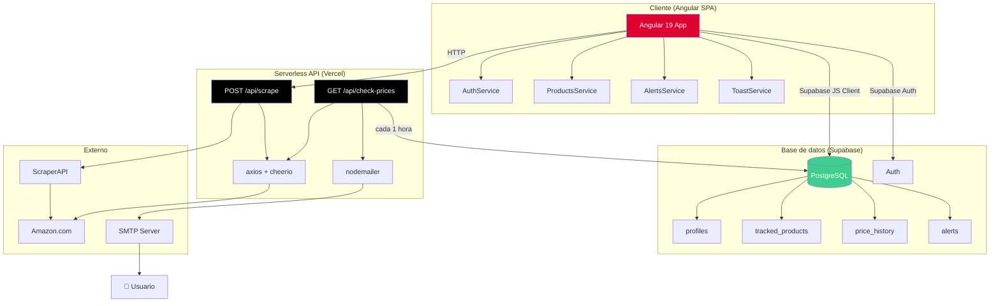

<div align="center">

# 🔔 PriceAlert

### Rastrea precios de Amazon y recibe alertas por email cuando bajan

[](https://angular.dev)
[](https://supabase.com)
[](https://vercel.com)
[](https://www.typescriptlang.org)
[](https://tailwindcss.com)
[](LICENSE)

</div>

---

## 📋 Tabla de contenidos

- [¿Qué es PriceAlert?](#-qué-es-pricealert)
- [Funcionalidades](#-funcionalidades)
- [Arquitectura](#-arquitectura)
- [Tecnologías](#-tecnologías)
- [Prerrequisitos](#-prerrequisitos)
- [Inicio rápido](#-inicio-rápido)
- [Variables de entorno](#-variables-de-entorno)
- [Configuración de Supabase](#-configuración-de-supabase)
- [Desarrollo local](#-desarrollo-local)
- [Despliegue en Vercel](#-despliegue-en-vercel)
- [Documentación de la API](#-documentación-de-la-api)
- [Cron Job](#-cron-job)
- [Estructura del proyecto](#-estructura-del-proyecto)
- [Contribuir](#-contribuir)
- [Licencia](#-licencia)
- [Aviso legal](#-aviso-legal)
- [Cumplimiento legal y suscripciones](#️-cumplimiento-legal-y-suscripciones-rama-featurelegal-and-payments)

---

## 🎯 ¿Qué es PriceAlert?

**PriceAlert** es una aplicación web completa que te permite:

1. **Añadir productos de Amazon** pegando la URL del producto.
2. **Rastrear el historial de precios** con gráficos interactivos.
3. **Configurar alertas de precio** — te avisamos cuando el precio cae por debajo de tu objetivo.
4. **Recibir notificaciones por email** de forma automática gracias a un cron job que comprueba los precios cada hora.

Todo ello con una interfaz limpia, responsive y en tiempo real, sin backend tradicional: solo Angular + Supabase + Vercel Serverless.

---

## ✨ Funcionalidades

| Función                        | Descripción                                                                        |
| ------------------------------ | ---------------------------------------------------------------------------------- |
| 🔐 **Autenticación**           | Registro e inicio de sesión con email/contraseña (Supabase Auth)                   |
| 🛒 **Rastreo de productos**    | Añade cualquier URL de Amazon (ES, COM, UK, DE, FR, IT, MX...)                     |
| 📊 **Historial de precios**    | Gráficos de evolución de precio (7, 30, 90 días) con Chart.js                      |
| 🔔 **Alertas personalizadas**  | Define el precio objetivo y activa la notificación por email                       |
| 📧 **Emails HTML**             | Emails automáticos con imagen del producto, precio, % descuento y enlace directo   |
| ♻️ **Actualización manual**    | Refresca el precio de cualquier producto a demanda                                 |
| ⚙️ **Configuración de cuenta** | Cambio de email y contraseña con re-autenticación previa para mayor seguridad      |
| 🌓 **Modo oscuro**             | Alternancia claro/oscuro persistida en localStorage; respeta la preferencia del SO |
| 📱 **Diseño responsive**       | Funciona perfectamente en móvil, tablet y escritorio                               |
| 🎨 **UI moderna**              | Interfaz con Tailwind CSS, transiciones suaves y animaciones fluidas               |

---

## 🏗️ Arquitectura



### Flujo de datos

```
Usuario añade URL de Amazon
        │
        ▼
POST /api/scrape                     ← Vercel Serverless
  ├─ Extrae ASIN, título, precio
  ├─ Imagen y disponibilidad
  └─ Retorna ScrapeResult
        │
        ▼
ProductsService                      ← Angular Service
  ├─ Guarda en tracked_products
  └─ Inserta en price_history
        │
        ▼
Cron job (cada hora)                 ← Vercel Cron
  ├─ GET /api/check-prices
  ├─ Re-scrapes todos los productos
  ├─ Actualiza precios e historial
  └─ Envía emails para alertas disparadas
```

---

## 🛠️ Tecnologías

### Frontend

| Paquete                 | Versión | Uso                                                 |
| ----------------------- | ------- | --------------------------------------------------- |
| `@angular/core`         | 19.x    | Framework principal, Signals, Standalone Components |
| `@supabase/supabase-js` | 2.x     | Cliente DB + Auth                                   |
| `chart.js`              | 4.x     | Gráficos de historial de precios                    |
| `tailwindcss`           | 3.x     | Utilidades CSS                                      |

### Backend (Serverless)

| Paquete        | Versión | Uso                                    |
| -------------- | ------- | -------------------------------------- |
| `axios`        | 1.x     | HTTP client para scraping              |
| `cheerio`      | 1.x     | HTML parsing (jQuery-like)             |
| `nodemailer`   | 8.x     | Envío de emails SMTP                   |
| `@vercel/node` | latest  | Tipos TypeScript para funciones Vercel |

### Infraestructura

| Servicio                    | Uso                                            |
| --------------------------- | ---------------------------------------------- |
| **Vercel**                  | Hosting SPA + Serverless Functions + Cron Jobs |
| **Supabase**                | PostgreSQL + Auth + Row Level Security         |
| **ScraperAPI** _(opcional)_ | Proxy para evitar bloqueos de Amazon           |

---

## 📦 Prerrequisitos

- [Node.js](https://nodejs.org/) v18 o superior
- [npm](https://npmjs.com) v9 o superior
- [Angular CLI](https://angular.dev/tools/cli) v19: `npm install -g @angular/cli`
- Cuenta en [Supabase](https://supabase.com) (gratuita)
- Cuenta en [Vercel](https://vercel.com) (gratuita)
- _(Opcional)_ Cuenta en [ScraperAPI](https://www.scraperapi.com) para producción

---

## 🚀 Inicio rápido

### 1. Clonar el repositorio

```bash
git clone https://github.com/tuusuario/price-alert.git
cd price-alert
```

### 2. Instalar dependencias

```bash
npm install
```

### 3. Configurar variables de entorno

```bash
cp .env.example .env.local
```

Edita `.env.local` con tus credenciales (ver [Variables de entorno](#-variables-de-entorno)).

### 4. Configurar Supabase

Ejecuta el script SQL en tu proyecto de Supabase (ver [Configuración de Supabase](#-configuración-de-supabase)).

### 5. Actualizar entorno de desarrollo

Edita `src/environments/environment.ts`:

```typescript
export const environment = {
  production: false,
  supabaseUrl: "https://TU_PROJECT_ID.supabase.co",
  supabaseAnonKey: "tu_anon_key",
  apiUrl: "http://localhost:3000",
};
```

### 6. Iniciar el servidor de desarrollo

```bash
npm start
```

Abre [http://localhost:4200](http://localhost:4200) en tu navegador.

---

## 🔑 Variables de entorno

Copia `.env.example` a `.env.local` y rellena los valores:

| Variable                    | Requerida | Descripción                                    |
| --------------------------- | --------- | ---------------------------------------------- |
| `SUPABASE_URL`              | ✅        | URL de tu proyecto Supabase                    |
| `SUPABASE_ANON_KEY`         | ✅        | Clave pública anónima de Supabase              |
| `SUPABASE_SERVICE_ROLE_KEY` | ✅        | Clave de servicio (solo para serverless)       |
| `CRON_SECRET`               | ✅        | Secret para autenticar el cron job             |
| `SMTP_HOST`                 | ✅        | Servidor SMTP (ej: `smtp.gmail.com`)           |
| `SMTP_PORT`                 | ✅        | Puerto SMTP (`587` para TLS, `465` para SSL)   |
| `SMTP_USER`                 | ✅        | Usuario SMTP (tu email)                        |
| `SMTP_PASS`                 | ✅        | Contraseña SMTP (App Password para Gmail)      |
| `EMAIL_FROM`                | ✅        | Dirección del remitente                        |
| `SCRAPER_API_KEY`           | ⚡        | Clave ScraperAPI (recomendada para producción) |

> ⚠️ **Importante:** `SUPABASE_SERVICE_ROLE_KEY` tiene acceso completo a tu base de datos. Nunca la expongas en el cliente. Solo se usa en las funciones serverless.

### Obtener credenciales de Gmail (App Password)

1. Activa la verificación en dos pasos en tu cuenta de Google
2. Ve a [Contraseñas de aplicación](https://myaccount.google.com/apppasswords)
3. Genera una contraseña para "Correo" + "Windows" (o el nombre que prefieras)
4. Usa esa contraseña como `SMTP_PASS`

---

## 🗄️ Configuración de Supabase

### 1. Crear un proyecto

1. Ve a [supabase.com](https://supabase.com) y crea una cuenta
2. Crea un nuevo proyecto (anota la URL y las claves API)

### 2. Ejecutar la migración SQL

1. En el dashboard de Supabase, ve a **SQL Editor**
2. Copia y pega el contenido de `supabase/migrations/001_initial_schema.sql`
3. Haz clic en **Run**

El script crea:

- Tabla `profiles` (perfil de usuario con preferencias)
- Tabla `tracked_products` (productos rastreados)
- Tabla `price_history` (historial de precios)
- Tabla `alerts` (alertas configuradas)
- **Row Level Security** en todas las tablas
- **Trigger automático** para crear el perfil al registrarse
- Índices de rendimiento

### 3. Configurar Auth

1. Ve a **Authentication > Settings**
2. Desactiva "Confirm email" si quieres registro inmediato (útil para desarrollo)
3. _(Opcional)_ Configura un proveedor OAuth (Google, GitHub)

---

## 💻 Desarrollo local

### Comandos disponibles

```bash
# Servidor de desarrollo Angular (puerto 4200)
npm start

# Servidor de la API local con recarga automática (puerto 3000)
npm run api

# Build de producción
npm run build

# Build de desarrollo
npm run build:dev

# Tests unitarios (una sola ejecución, sin modo watch)
npm test -- --watch=false --browsers=ChromeHeadless --no-progress

# Tests en modo watch
npm test
```

> 💡 Para desarrollo completo necesitas **dos terminales**: una con `npm start` y otra con `npm run api`.

### Probar las funciones serverless localmente

Opción A — servidor local ligero (recomendado para desarrollo):

```bash
npm run api
```

Opción B — entorno Vercel completo (requiere [Vercel CLI](https://vercel.com/docs/cli)):

```bash
npm install -g vercel
vercel dev --listen 3000
```

Ambas opciones levantan las funciones en `http://localhost:3000/api/`.

### Probar el endpoint de scraping

```bash
curl -X POST http://localhost:3000/api/scrape \
  -H "Content-Type: application/json" \
  -d '{"url": "https://www.amazon.es/dp/B08N5KWB9H"}'
```

Respuesta esperada:

```json
{
  "title": "Nombre del producto",
  "price": 29.99,
  "original_price": 49.99,
  "currency": "EUR",
  "image_url": "https://...",
  "asin": "B08N5KWB9H",
  "availability": "in_stock"
}
```

---

## 🚢 Despliegue en Vercel

### 1. Conectar el repositorio

1. Ve a [vercel.com/new](https://vercel.com/new)
2. Importa tu repositorio de GitHub
3. Vercel detectará automáticamente Angular como framework

### 2. Configurar variables de entorno

En el dashboard de Vercel, ve a **Settings > Environment Variables** y añade todas las variables de la sección anterior.

### 3. Configurar el Cron Job

El cron job ya está configurado en `vercel.json`:

```json
"crons": [
  {
    "path": "/api/check-prices",
    "schedule": "0 * * * *"
  }
]
```

Esto ejecuta el check de precios **cada hora**. Para cambiar la frecuencia, modifica el `schedule` usando [sintaxis cron](https://crontab.guru/).

> ⚠️ Los cron jobs de Vercel requieren un plan **Pro** o superior.
> Para el plan gratuito, usa un servicio externo como [cron-job.org](https://cron-job.org) que llame a `GET https://tu-app.vercel.app/api/check-prices` con el header `Authorization: Bearer TU_CRON_SECRET`.

### 4. Deploy

```bash
# Deploy manual
vercel --prod

# O simplemente haz push a main y Vercel lo desplegará automáticamente
git push origin main
```

---

## 📡 Documentación de la API

### `POST /api/scrape`

Extrae los datos de un producto de Amazon.

**Body:**

```json
{
  "url": "https://www.amazon.es/dp/B08N5KWB9H"
}
```

**Respuesta exitosa (`200`):**

```json
{
  "title": "Echo Dot (5ª generación, 2022)",
  "price": 29.99,
  "original_price": 59.99,
  "currency": "EUR",
  "image_url": "https://m.media-amazon.com/images/...",
  "asin": "B09B8RVKGW",
  "availability": "in_stock"
}
```

**Errores posibles:**
| Código | Mensaje | Causa |
|---|---|---|
| `400` | `URL de Amazon no válida` | URL no pertenece a Amazon |
| `429` | `Amazon ha bloqueado la solicitud` | Rate limiting / CAPTCHA |
| `500` | `No se pudo extraer el precio del producto. Verifica la URL y vuelve a intentarlo.` | Producto sin precio visible o URL inválida |

---

### `GET /api/check-prices`

Comprueba todos los productos activos y envía alertas de email.

**Headers requeridos:**

```
Authorization: Bearer TU_CRON_SECRET
```

**Respuesta exitosa (`200`):**

```json
{
  "message": "Price check complete",
  "checked": 12,
  "alertsSent": 2,
  "results": ["✓ B09B8RVKGW: 29.99 EUR", "✓ B08N5KWB9H: 15.49 EUR", "✗ B07XJ8C8F5: Request timeout"]
}
```

---

## ⏱️ Cron Job

El cron job `/api/check-prices`:

1. **Autentica** la petición con `CRON_SECRET`
2. **Obtiene** hasta 50 productos con alerta activa, ordenados por `last_checked`
3. **Re-scrapes** el precio actual de cada producto
4. **Actualiza** `current_price`, `availability` y `last_checked` en la base de datos
5. **Inserta** un registro en `price_history`
6. **Comprueba** si el precio es ≤ al `threshold_price` configurado
7. **Envía un email HTML** a los usuarios con `email_notifications = true`
8. **Marca** la alerta como `triggered = true` y `sent_email = true`
9. Espera **500ms entre productos** para evitar rate limiting

---

## 📁 Estructura del proyecto

```
price-alert/
├── api/                          # Vercel Serverless Functions
│   ├── scrape.ts                 # POST - Scraper de Amazon
│   └── check-prices.ts           # GET  - Cron job de verificación
│
├── src/
│   ├── app/
│   │   ├── core/
│   │   │   ├── guards/auth.guard.ts
│   │   │   ├── models/           # Interfaces TypeScript
│   │   │   └── services/
│   │   │       ├── auth.service.ts       # Supabase Auth + cambio de email/contraseña
│   │   │       ├── products.service.ts   # CRUD productos + scraping
│   │   │       ├── alerts.service.ts     # Gestión de alertas
│   │   │       └── theme.service.ts      # Modo claro/oscuro (señal + localStorage)
│   │   ├── features/
│   │   │   ├── auth/             # Login y Registro
│   │   │   ├── alerts/           # Gestión de alertas
│   │   │   ├── dashboard/        # Panel principal
│   │   │   ├── products/         # Lista, Detalle y Añadir producto
│   │   │   └── settings/         # Perfil, cambio de email y contraseña
│   │   └── shared/
│   │       └── components/       # Navbar (con toggle de tema), PriceChart, ProductCard, Toast
│   ├── environments/             # Configuración dev/prod
│   ├── index.html
│   ├── main.ts
│   └── styles.scss               # Tailwind + clases globales + overrides modo oscuro
│
├── supabase/
│   └── migrations/
│       └── 001_initial_schema.sql
│
├── .env.example
├── angular.json
├── package.json
├── tailwind.config.js
├── tsconfig.api.json
├── tsconfig.json
└── vercel.json
```

---

## ⚖️ Cumplimiento legal y suscripciones (rama `feature/legal-and-payments`)

Esta rama añade toda la infraestructura legal y de pagos necesaria para operar PriceAlert como un servicio con suscripción de pago en España / Unión Europea, cumpliendo con la **LSSI-CE**, el **RGPD** y el **RDL 1/2007**.

### Páginas legales

Se han creado cinco páginas accesibles públicamente bajo la ruta `/legal/`:

| Ruta                 | Contenido                                                                                                 |
| -------------------- | --------------------------------------------------------------------------------------------------------- |
| `/legal/aviso-legal` | Aviso Legal (LSSI-CE): identificación del titular, domicilio y datos de contacto                          |
| `/legal/privacidad`  | Política de Privacidad (RGPD): base jurídica, datos recogidos, encargados del tratamiento, derechos ARCO+ |
| `/legal/terminos`    | Términos y Condiciones: descripción de planes, obligaciones, limitación de responsabilidad                |
| `/legal/cookies`     | Política de Cookies: tabla de cookies esenciales usadas (sin cookies publicitarias)                       |
| `/legal/cancelacion` | Política de Cancelación y Reembolsos: garantía de 14 días, cancelación en cualquier momento               |

---

### Banner de cookies y consentimiento (RGPD)

- Se muestra un **banner fijo** en la parte inferior al primer acceso, antes de registrarse.
- El usuario puede elegir entre **"Solo esenciales"** o **"Aceptar todo"**.
- La elección se persiste en `localStorage` bajo la clave `pricealert_cookie_consent`.
- Las cookies usadas son exclusivamente **esenciales** (sesión de Supabase, tema y preferencia de cookies); no se usan cookies publicitarias ni de terceros.

---

### Consentimiento en el registro

El formulario de registro incorpora dos nuevas casillas antes del botón de envío:

- ☑️ **Obligatoria:** aceptación de los Términos y Condiciones y la Política de Privacidad (impide el registro si no se marca).
- ☐ **Opcional:** consentimiento para recibir comunicaciones de marketing por email.

---

### Planes de suscripción

| Plan         | Precio     | Productos máx. | Alertas                          |
| ------------ | ---------- | -------------- | -------------------------------- |
| **Gratuito** | 0 €/mes    | 5              | Ilimitadas                       |
| **Premium**  | 4,99 €/mes | 25             | Ilimitadas + soporte prioritario |

Los límites se aplican dinámicamente en `products.service.ts`: el plan se lee del perfil del usuario en cada intento de añadir un producto.

---

### Integración con Stripe

El flujo de pago usa **Stripe Checkout** (hosted), de forma que ningún dato de tarjeta pasa por la aplicación (sin requisitos PCI-DSS propios).

**Nuevos endpoints serverless:**

| Método | Ruta                           | Descripción                                                                  |
| ------ | ------------------------------ | ---------------------------------------------------------------------------- |
| `POST` | `/api/create-checkout-session` | Busca o crea el cliente de Stripe, crea una sesión de pago y devuelve la URL |
| `POST` | `/api/stripe-webhook`          | Recibe eventos de Stripe y actualiza el plan del usuario en Supabase         |

**Eventos de Stripe manejados:**

| Evento                          | Acción                                             |
| ------------------------------- | -------------------------------------------------- |
| `checkout.session.completed`    | Activa el plan Premium y guarda IDs de Stripe      |
| `customer.subscription.deleted` | Degrada al plan Gratuito y limpia el ID            |
| `customer.subscription.updated` | Sincroniza el estado del plan (activo / cancelado) |

**Variables de entorno adicionales necesarias:**

| Variable                | Descripción                                             |
| ----------------------- | ------------------------------------------------------- |
| `STRIPE_SECRET_KEY`     | Clave secreta de Stripe (`sk_live_...` o `sk_test_...`) |
| `STRIPE_PRICE_ID`       | ID del precio recurrente creado en el dashboard Stripe  |
| `STRIPE_WEBHOOK_SECRET` | Signing secret del webhook (`whsec_...`)                |
| `APP_URL`               | URL base de la app (ej: `https://tudominio.com`)        |

---

### Migración de base de datos

Ejecuta `supabase/migrations/002_add_subscription.sql` en **Supabase Dashboard > SQL Editor** para añadir las columnas de suscripción a la tabla `profiles`:

```sql
ALTER TABLE profiles
  ADD COLUMN plan TEXT NOT NULL DEFAULT 'free',
  ADD COLUMN stripe_customer_id TEXT,
  ADD COLUMN stripe_subscription_id TEXT;
```

---

### Pasos de configuración de Stripe (resumen)

1. Crea una cuenta en [dashboard.stripe.com](https://dashboard.stripe.com) (gratuita, sin cuota mensual).
2. Crea un **Producto** con un precio recurrente de **4,99 €/mes** → copia el `price_XXXX`.
3. Añade `STRIPE_SECRET_KEY` y `STRIPE_PRICE_ID` a `.env.local` (y a Vercel en producción).
4. En **Developers > Webhooks**, crea un endpoint apuntando a `https://tudominio.vercel.app/api/stripe-webhook` para los eventos listados arriba.
5. Copia el signing secret (`whsec_...`) como `STRIPE_WEBHOOK_SECRET`.

---

## 🤝 Contribuir

Las contribuciones son bienvenidas. Para cambios importantes, abre primero un issue.

```bash
git checkout -b feature/nueva-funcionalidad
git commit -m "feat: añadir soporte para AliExpress"
git push origin feature/nueva-funcionalidad
# Abre un Pull Request
```

### Convenciones de commit

| Prefijo     | Uso                      |
| ----------- | ------------------------ |
| `feat:`     | Nueva funcionalidad      |
| `fix:`      | Corrección de bug        |
| `docs:`     | Cambios en documentación |
| `refactor:` | Refactorización          |
| `chore:`    | Dependencias, CI/CD      |

---

## 📄 Licencia

Distribuido bajo la licencia MIT.

---

## ⚠️ Aviso legal

> **PriceAlert** utiliza scraping de HTML para extraer información pública de Amazon. El uso de scrapers automatizados puede estar sujeto a los [Términos de Uso de Amazon](https://www.amazon.es/gp/help/customer/display.html?nodeId=201909000). Este proyecto es únicamente con fines educativos y personales.
>
> - **No uses este proyecto de forma comercial** sin revisar la legalidad aplicable en tu jurisdicción.
> - Los precios y disponibilidad mostrados pueden no ser exactos en tiempo real.
> - Los autores no se responsabilizan del uso que se haga de este software.
>
> Se recomienda el uso de la [API oficial de Amazon (PA-API)](https://affiliate-program.amazon.com/help/node/topic/GM25M3Q2DSPKWH6Z) para aplicaciones en producción.

---

<div align="center">
Hecho con ❤️ usando Angular, Supabase y Vercel
</div>
